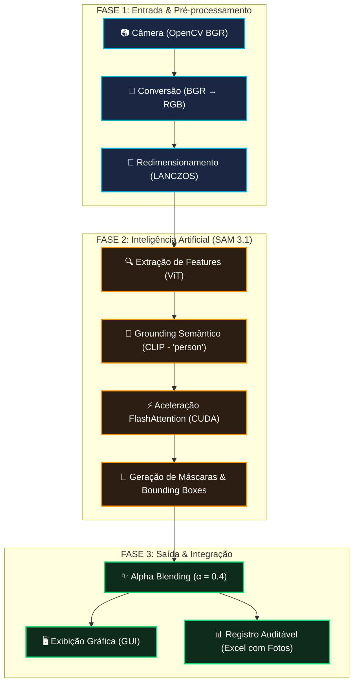

# 🚇 MetroVision AI — Pipeline de Visão Computacional
> Mapeamento técnico detalhado e pedagógico do fluxo de processamento de imagem, IA e integração.

Este documento explica de forma clara, didática e aprofundada como o **MetroVision AI** transforma frames brutos capturados pelas câmeras de segurança dos vagões de metrô em dados de ocupação legíveis, auditáveis e prontos para o passageiro.

---

## 🗺️ Visão Geral do Fluxo (Workflow)



---

## 📹 Fase 1: Entrada e Pré-processamento (A Amostragem)

Esta fase é responsável por converter a luz física do vagão em dados digitais prontos e otimizados para a Inteligência Artificial.

### 1. Captura de Câmera (OpenCV)
*   **O que acontece:** O OpenCV conecta-se ao fluxo de vídeo (ou câmera real) usando a classe `cv2.VideoCapture` e extrai frames continuamente a uma taxa de **~33 FPS** (um quadro a cada ~30ms).
*   **O detalhe técnico:** O OpenCV carrega, por padrão histórico, as imagens no espaço de cores **BGR** (Blue, Green, Red).
*   **Código:**
    ```python
    ret, frame = self.cap.read()
    ```

### 2. Conversão de Espaço de Cores (BGR → RGB)
*   **Por que é necessária:** Redes Neurais profundas modernas e bibliotecas de manipulação de imagem (como o Pillow/PIL) foram treinadas e esperam o formato padrão **RGB** (Red, Green, Blue). Se o frame fosse enviado em BGR diretamente para a IA, os canais de azul e vermelho estariam invertidos, degradando severamente a capacidade de reconhecimento do modelo.
*   **Código:**
    ```python
    cv_img = cv2.cvtColor(frame, cv2.COLOR_BGR2RGB)
    ```

### 3. Redimensionamento Inteligente (Filtro LANCZOS)
*   **Por que é necessária:** O modelo SAM 3.1 original é computacionalmente pesado. Passar uma imagem em alta resolução (como 1080p ou mesmo 480p) faria o tempo de inferência explodir. Para permitir o tempo real, o frame é redimensionado para uma altura operacional menor (ex: 144px).
*   **A matemática (Teorema de Nyquist-Shannon):** Reduzir simplesmente descartando pixels gera **aliasing** (serrilhado e ruído de alta frequência). Para evitar isso, usamos o **Filtro de Reamostragem LANCZOS** (um interpolador baseado na função sinc). Ele atua como um filtro passa-baixa matemático perfeito antes do downscale, preservando contornos suaves e detalhes essenciais dos passageiros.
*   **Código:**
    ```python
    working_img = orig_img.resize((target_w, target_h), Image.Resampling.LANCZOS)
    ```

---

## 🧠 Fase 2: O Núcleo de Inteligência Artificial (SAM 3.1)

Aqui, a imagem limpa e redimensionada entra no modelo de Deep Learning para que cada passageiro seja identificado de forma cirúrgica.

```
                  ┌───────────────────────┐
                  │ Imagem de Entrada RGB │
                  └───────────┬───────────┘
                              ▼
               ┌─────────────────────────────┐
               │ Backbone Vision Transformer │  ◄── Otimizado via FlashAttention (SDPA)
               │    (ViT: set_image())       │
               └──────────────┬──────────────┘
                              ▼
┌──────────────────┐   ┌──────────────┐
│  Prompt de Texto │──►│ CLIP Encoder │
│    "person"      │   └──────┬───────┘
└──────────────────┘          │
                              ▼
               ┌─────────────────────────────┐
               │     Decoder do SAM 3.1      │
               │   (Cross-Attention MHA)     │
               └──────────────┬──────────────┘
                              ▼
               ┌─────────────────────────────┐
               │  Máscaras + Bounding Boxes  │
               └─────────────────────────────┘
```

### 1. Extração de Features (set_image)
*   **O que acontece:** O backbone do SAM 3.1 (um Vision Transformer - ViT) processa a imagem RGB e gera um mapa de embeddings visuais de alta dimensão. Este mapa representa toda a estrutura semântica da cena física.
*   **Código:**
    ```python
    state = self.processor.set_image(working_img, state)
    ```

### 2. Grounding Semântico via CLIP (set_text_prompt)
*   **O que acontece:** O modelo recebe o comando textual `"person"` (passageiro). Um encoder de linguagem (baseado no CLIP) traduz essa string em um vetor semântico.
*   **Cross-Attention:** A IA realiza uma operação matemática chamada Atenção Cruzada (Cross-Attention) entre o mapa de embeddings visuais da imagem e o vetor da palavra `"person"`. Isso ativa especificamente as regiões da imagem que contêm pessoas.
*   **Zero-Shot:** Significa que o modelo **não precisou de re-treinamento** específico na fábrica para aprender o que é um passageiro; ele usa seu pré-treinamento maciço para entender o conceito imediatamente.
*   **Código:**
    ```python
    state = self.processor.set_text_prompt("person", state)
    ```

### 3. Otimização de Performance (FlashAttention / SDPA)
*   **O Gargalo:** O mecanismo de atenção clássico computa a relação entre cada patch da imagem com todos os outros. Isso tem uma complexidade quadrática de **$O(N^2)$**, onde $N$ é o número de tokens. Em GPUs convencionais, isso causava uma latência insustentável de **24,8 segundos por frame**!
*   **A Solução (FlashAttention):** Habilitamos o SDPA (Scaled Dot-Product Attention) otimizado por CUDA na GPU. Em vez de salvar matrizes gigantescas na memória RAM lenta da GPU (VRAM), o FlashAttention divide as matrizes de atenção em blocos (tiling) e processa tudo na memória cache interna ultrarrápida do chip (SRAM).
*   **O Resultado:** A latência caiu de **24.8s para apenas 0.43s por frame** (um ganho absurdo de **58× mais velocidade**), viabilizando o monitoramento em tempo real.
*   **Código:**
    ```python
    torch.backends.cuda.enable_flash_sdp(True)
    torch.backends.cuda.enable_mem_efficient_sdp(True)
    # Executado dentro de escopo otimizado:
    with torch.inference_mode():
        with torch.autocast("cuda", dtype=torch.bfloat16):
            # ... inferência do SAM 3.1 ...
    ```

---

## 🖥️ Fase 3: Saída, Composição Visual e Registro

Uma vez que a IA identificou os passageiros, os dados são processados para gerar as saídas visuais e de auditoria.

### 1. Alpha Blending (Fusão de Imagens)
*   **O que acontece:** O SAM 3.1 gera uma máscara booleana binária (matriz de True/False) para cada pessoa detectada. Para gerar a visualização colorida, mesclamos uma cor semi-transparente sobre o frame físico original.
*   **A Fórmula Matemática do Compositing:**
    $$C_{out} = \alpha \cdot C_{overlay} + (1 - \alpha) \cdot C_{background}$$
    Onde:
    *   $C_{out}$: Pixel resultante final.
    *   $C_{overlay}$: Cor da máscara atribuída a essa pessoa.
    *   $C_{background}$: Pixel original da câmera.
    *   $\alpha$ (Alpha): Fator de opacidade (definido como **0.4** ou 40%).
*   **O Benefício:** Permite ao operador ver os contornos coloridos de cada passageiro sem obstruir ou esconder a imagem de segurança original de fundo.
*   **Código:**
    ```python
    frame[overlay_mask_bool] = (
        frame[overlay_mask_bool] * 0.6 + 
        overlay_mask[overlay_mask_bool] * 0.4
    ).astype(np.uint8)
    ```

### 2. Exibição na GUI (Tkinter Premium)
*   O frame composto finalizado é renderizado na tela do operador através de uma interface de usuário rica (Dark Mode Premium), exibindo em destaque o **Número de Passageiros Contados**.
*   Essa informação em tempo real pode ser integrada a uma API para alimentar os painéis informativos na plataforma do metrô, indicando quais vagões estão mais vazios.

### 3. Registro Auditável em Excel
*   Para fins de auditoria, estatísticas e planejamento de fluxo de longo prazo, todos os dados são registrados em uma planilha Excel usando `openpyxl`.
*   **Miniaturas Visuais:** O diferencial é que o sistema salva uma miniatura física (thumbnail 150×100) do vagão exatamente no instante da contagem e a insere diretamente na linha da planilha, permitindo que fiscais do metrô auditem visualmente se a IA errou ou acertou a contagem daquele horário.
*   **Código:**
    ```python
    row_data = [timestamp, video_time, count, prompt, img_path]
    ws.append(row_data)
    img = OpenpyxlImage(img_path)
    ws.add_image(img, f"F{row_idx}")
    ```

---

## 📊 Tabela Resumo do Pipeline

| Passo | Função Principal | Entrada | Saída | Otimização Chave |
| :--- | :--- | :--- | :--- | :--- |
| **1. Câmera** | Aquisição de Imagem | Luz Física | Array BGR | Captura assíncrona @ 33 FPS |
| **2. Conversão** | Mudança de Espaço de Cor | Array BGR | Array RGB | `cv2.cvtColor` nativo |
| **3. Resize** | Redução de Escala | Imagem RGB | Imagem 254×144 | Filtro LANCZOS (Anti-Aliasing) |
| **4. Backbone** | Extração de Features | Imagem 144p | Features ViT | GPU Tensor Cores + bfloat16 |
| **5. CLIP** | Alinhamento de Conceitos | Texto `"person"` | Vetor Semântico | Cross-Attention incorporado |
| **6. Atenção** | Fusão Semântica | Vetores visuais | Máscaras | **FlashAttention (58× mais rápido)** |
| **7. Blending** | Visualização da Máscara | Máscara + Frame | Frame Composto | Composição de matrizes por indexação direta |
| **8. GUI** | Exibição de Dados | Frame Composto | Janela Tkinter | Tkinter Canvas assíncrono |
| **9. Log** | Registro Auditável | Dados da contagem | Linha Excel com Imagem | Salvamento em disco assíncrono |

---

> [!NOTE]
> Este pipeline completo garante que o **MetroVision AI** opere no estado da arte da visão computacional móvel, aliando a flexibilidade incrível do modelo SAM 3.1 com velocidades aptas para produção e auditoria contínua de fluxo.
